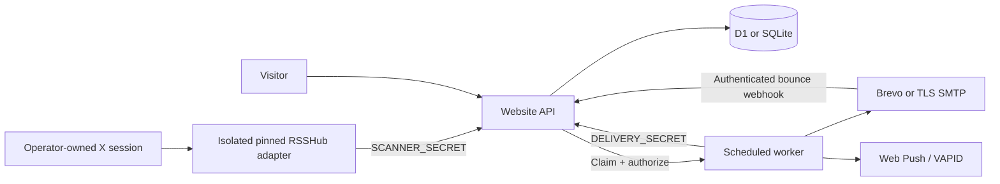

# Architecture

The website uses the TypeScript Sites/Vinext starter and renders a small React UI. Native form controls keep the initial bundle small. SQL and runtime-specific bindings remain server-only; contacts never appear in public responses. WebMCP exposes one explicit staging action, `set_display_timezone`, which changes the visible form and does not subscribe anyone.

## Source boundary

`scripts/setup-source.mjs` installs an exact upstream commit and its frozen dependencies without lifecycle scripts. `source-check.mjs` checks the revision and isolates the collector in a child process with only the X session and minimal environment. Upstream output is not logged. Timeouts kill the process group; temporary output is private and removed.

The collector calls RSSHub’s authenticated web adapter directly. The stock RSS route can hide upstream failures, so HTTP 200/feed XML is insufficient evidence. The harness requires authorship, full own text, publication timestamps, replies, valid GraphQL data and supported timeline structure. It excludes reposts and keeps quoted content out of recognition. Preview-only and unrecoverable truncated content fail closed.

Continuity uses an exact previous newest primary timeline unit: entry ID, ranking value and source-post-ID set. An old conversation root cannot prove coverage. Missing overlap creates a sticky public coverage gap. This is observed window continuity, not proof that X never omits a post. No cursor pagination or paid fallback is attempted. Changes to existing source text require operator review rather than silent replacement.

## Event and time model

Recognition is conservative English pattern matching, not an external model call. Clear relative durations anchor to `publishedAt`. PT/ET are IANA zones; explicit PST/PDT are fixed offsets. Invalid dates, ambiguous/missing DST wall times and uncertain phrases stay unresolved. Eligibility/claim/upgrade deadlines are excluded from scheduling. Unsupported language can be missed; representative tests document what is recognized.

A correction reply updates an event revision, cancels its older jobs and creates new eligible reminders. An explicitly additional reset creates a separate event. Casual replies preserve the current event. Bootstrap does not send historical announcements; an unexpired future reminder can still be enrolled.

## Delivery state

`pending → leased → sending → sent/delivered`, with terminal `cancelled`, `expired`, `skipped`, `failed`, `unknown` or `permanent` outcomes. A worker claims one job for120seconds, then requests a just-in-time authorization. Eligibility, subscription status, event revision and quota are checked before revealing the destination. A unique attempt identity accompanies each provider submission.

Leases that expire before authorization return to pending. A process lost after authorization may already have sent: those jobs become `unknown`, never automatically retried. This trades occasional missed alerts for avoiding blind duplicate sends. HTTP429 can retry at five-minute intervals up to three attempts; ambiguous network/5xx outcomes cannot. Unsubscribe/corrections can cancel work before authorization; an already submitted network request cannot be recalled.

The SQL batch reserves email capacity and transitions the job to sending atomically. SQLite batches use BEGIN IMMEDIATE; D1 uses transactional batches. Quotas count attempts, including private verification tests and retries. Distinct channels are filtered during ordinary claims. Test jobs use a separate explicit claim and cannot run after verification mode is disabled.

The worker attempts source collection first, but source errors do not prevent delivery. Separate heartbeats show source and delivery freshness; neither means every provider message reached its recipient. Public health becomes stale after15minutes.

## Data and trust

AES-GCM encrypts destinations and token-bearing message bodies. HMAC fingerprints permit duplicate/suppression checks without storing clear contact addresses. Bearer credentials for ingestion and job delivery are independent. Browser writes require the configured Origin; management cookies are HttpOnly, SameSite=Strict and Secure over HTTPS, separated by email/push. Email GET links do not confirm or unsubscribe; confirmation requires a POST. RFC8058 one-click unsubscribe uses its own scoped token.

Push destinations are restricted to supported standard service hosts and valid key shapes. Full device keys act as a recovery capability for an existing push subscription. Source/delivery credentials are never exposed to client JavaScript. On Cloudflare, the platform supplies the trusted client IP. Node trusts no client IP header unless an operator explicitly configures a proxy that strips and replaces it.

No schema migration is edited after deployment. The app is the only SQLite writer in Docker; the worker uses HTTP. Public posts/events expire after90days, delivery records after30days, pending/test subscriptions after2days and suppression fingerprints after30days. Cleanup is tied to worker execution.
